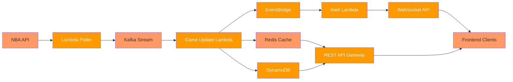

# NBAgames
NBA live score and alerts, it pulls most recent/scheduled games, with box score for the games. It also provides live updates.

# System Diagram

# Technology Stack
 - frontend:  Next.js v14.1.0(React v18.2.0), TypeScript, Tailwind CSS, Storybook v7.6.17.
 - backend:  Docker, Kafka, NestJS, Express, CORS, WebSocket, Redis, AWS SDK V3, AWS DynamoDB, Lambda, EventBridge, Restful API.
 - infrastructure: AWS CDK(IAM, CloudFormation, DynamoDB).
 - unit testing: Jest v29.7.0.
