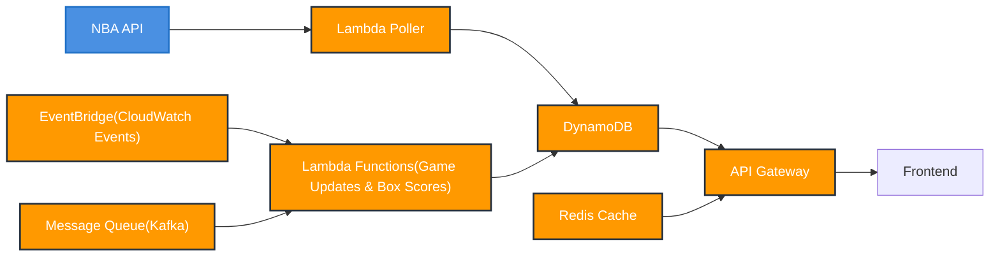

# NBAgames
NBA live score and alerts, it pulls most recent/scheduled games, with box score for the games. It also provides live updates.

# System Diagram(Data Flow)

# Technology Stack
 - frontend:  Next.js v14.1.0(React v18.2.0), TypeScript, Tailwind CSS, Storybook v7.6.17.
 - backend: Terraform, Docker, SQS, Kafka, NestJS, Express, CORS, WebSocket, Redis,ElastiCache, AWS SDK V3, AWS DynamoDB, Lambda, EventBridge, CloudWatch, Restful API.
 - infrastructure: AWS CDK(IAM, CloudFormation, DynamoDB).
 - unit testing: Jest v29.7.0.

# Note
 - to lower the cost of development and testing, use local Redis cache and Kafka(vs AWS MSK and ElastiCache Clusters, for production), the application has configurations in backend .env(refer to backend\.env.example, and backend\infrastructure\terraform\terraform.tfvars - please make sure the settings are consistent) to decide the facilities:
  - Cost control for dev environment
    * msk_instance_type = "kafka.t3.small"      # Instead of larger instances
    * redis_node_type = "cache.t3.micro"        # Smallest Redis instance

  - Development environment settings
    * use_local_services = true    # Use Docker Compose services
    * use_msk = false             # Don't deploy MSK
    * use_elasticache = false     # Don't deploy ElastiCache
    * use_sqs_instead_of_msk = true  # Don't use SQS in development

# Instructions 
 - clone the repo.
 - frontend
    * cd frontend
    * yarn install
    * yarn test # run unit tests
    * yarn dev
 - backend
    * cd backend
    * yarn install
    * docker-compose up -d # start the kafka and redis services locally
    * yarn test # run unit tests
    * cd infrastructure/terraform
    * terraform init
    * terraform plan -out=tfplan
    * terraform plan -destroy -out=tfdestroyplan 
    * cd ../../ # back to backend
    * ./infrastructure/scripts/deploy.ps1 # include packaging lambda functions & terraform apply
    * yarn dev #wait a few moments to have Redis ready
 - Useful tips:
    * example for SQS triggered lambda function invocation: aws sqs send-message --queue-url 'https://sqs.us-east-1.amazonaws.com/{account-id}/nba-live-updates-dev.fifo' --message-body '{"gameId":"0022400599","gameStatus":1,"homeTeam":{"teamId":"1610612766"},"awayTeam":{"teamId":"1610612742"}}' --message-group-id "game0022400599" 
    * check AWS resources: backend/infrastructure/scripts/check-tf-resources.ps1
    * check lambda functions logs:
        * aws logs tail "/aws/lambda/nba-live-game-update-dev"
        * aws logs tail "/aws/lambda/nba-live-box-score-dev"
    * cleanup: terraform destroy
